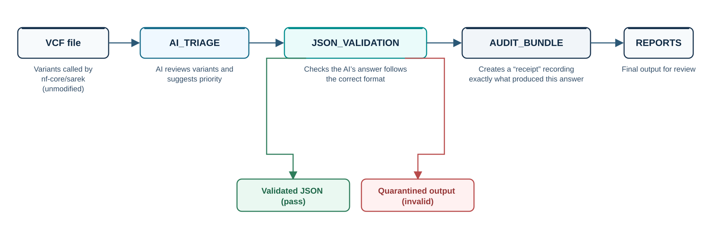

# Glass-Box AI Triage After nf-core/sarek: An Auditable, Low-Cost Nextflow Pattern

This project provides a small, reusable Nextflow subworkflow that sits immediately after an unmodified nf-core/sarek run to triage genetic variants.

When using AI to flag important variants in a patient's genome, variability and lack of traceability create a major "trust problem." This pattern solves that by ensuring every triage decision is highly reproducible, completely traceable, and strictly formatted, which is especially critical for small research groups in low- and middle-income countries requiring affordable infrastructure.

## Architecture

*VCF outputs from an unmodified nf-core/sarek run are triaged, validated against a strict schema, and packaged with a full audit trail before reaching final reports. Malformed outputs are quarantined rather than silently accepted.*

## Main Objectives

* **Strict Validation:** The AI_TRIAGE process forces the output into a schema-constrained JSON format rather than free text.
* **Quarantine Control:** A subsequent JSON_VALIDATION step actively quarantines any malformed outputs instead of silently accepting them.
* **Full Auditability:** The AUDIT_BUNDLE process creates a receipt for every single run.
* **Metadata Logging:** It securely logs the exact model version, prompt version, container digest, sarek commit, input hash, timestamp, and pass/fail status.
* **Low-Cost Accessibility:** The default deployment runs entirely on GitHub Codespaces with Docker (CPU-only), keeping baseline usage low-cost. The full evaluation experiment (repeated triage runs across conditions) targets a total cloud budget of approximately US$30.

## Project Structure

* `docs/`: Project documentation and notes.
* `diagrams/`: Architecture and workflow diagrams.
* `nextflow/`: Core pipeline code, including `modules/` and `subworkflow/`.
* `tests/`: Unit and integration tests for the pipeline.
* `examples/`: Example datasets and configurations.

## Getting Started

### Prerequisites

* Nextflow (version x.x.x)
* Docker

### Installation

Clone the repository:

git clone https://github.com/STaiMIC/glassbox-ai-triage.git

Navigate into the directory:

cd glassbox-ai-triage

## Usage

Run the main pipeline:

nextflow run main.nf -profile standard

## Testing

Instructions for how to run the files in the `tests/` directory.

## Contributing

Guidelines for how team members can contribute to this project.

## Status, licensing and attribution

Glass Box is an independent STAiMIC project and is not an official nf-core
pipeline. It is not affiliated with, endorsed by, or sponsored by nf-core,
the Nextflow project, or Seqera Labs.

Glass Box is implemented using Nextflow and is designed to process outputs
generated by nf-core/sarek. Nextflow® is a registered trademark of
Seqera Labs, S.L., used here descriptively.

STAiMIC-authored code is licensed under Apache-2.0. Any third-party source
code included in this repository remains under its original licence, as
identified by the file headers and **[THIRD_PARTY_NOTICES.md](THIRD_PARTY_NOTICES.md)**
